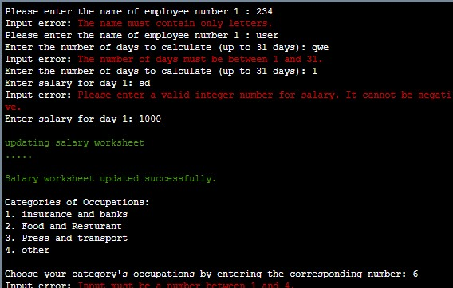
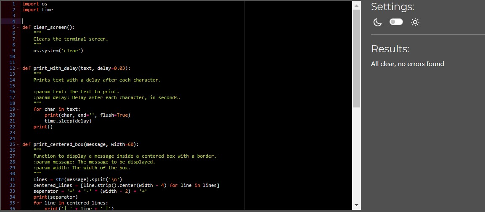
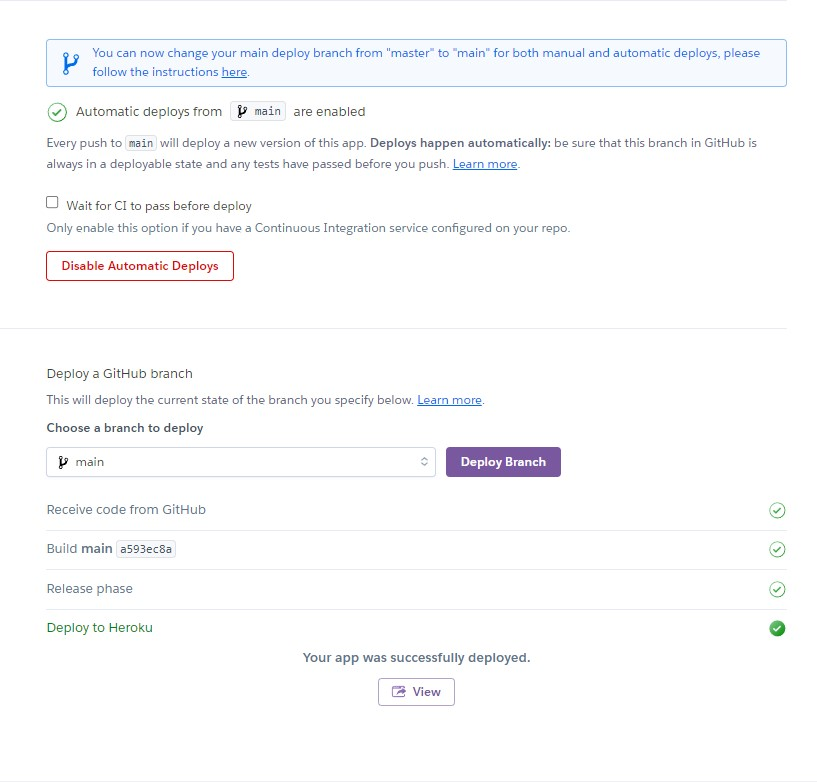

# Salary Calculator [Visit live website](https://salary-calculater-2dcdcf65c7ea.herokuapp.com//)

**Developer: Sanor Smith**

## About

Salary Calculator is an innovative and user-centric application developed with the objective of simplifying the complex task of salary computation for both individuals and companies. It stands as a testament to the fusion of technological advancement and financial management, aiming to transform the often daunting task of salary calculations into a straightforward, efficient process. By accommodating both individual users and businesses, the application showcases versatility, making it a suitable tool for diverse financial needs. Its robust user registration system ensures a personalized and secure experience, while the dual-mode functionality offers tailored interfaces and calculations for both single users and companies.

## Table of Contents
  - [Project Goals](#project-goals)
    - [User Goals](#user-goals)
    - [Site Owner Goals](#site-owner-goals)
  - [User Experience](#user-experience)
    - [Target Audience](#target-audience)
    - [User Requirements and Expectations](#user-requirements-and-expectations)
    - [User Manual](#user-manual)
  - [User Stories](#user-stories)
    - [Users](#users)
    - [Site Owner](#site-owner)
  - [Technical Design](#technical-design)
    - [Flowchart](#flowchart)
  - [Technologies Used](#technologies-used)
    - [Languages](#languages)
    - [Frameworks & Tools](#frameworks--tools)
    - [Libraries](#libraries)
  - [Features](#features)
  - [Validation](#validation)
  - [Testing](#testing)
    - [Manual Testing](#manual-testing)
    - [Automated Testing](#automated-testing)
  - [Bugs](#bugs)
  - [Deployment](#deployment)
  - [Credits](#credits)
  - [Acknowledgements](#acknowledgements)

## Project Goals

### User Goals

- Make salary computations easy and understandable for both individuals and businesses.
- Provide precise salary and tax calculations, incorporating specific factors like VAT and regional tax rates.
- Save time and reduce the effort involved in managing and calculating salaries.
- Offer a user-friendly and intuitive interface suitable for all skill levels.
- Implement robust validation to prevent mistakes in financial calculations.
- Help users understand salary structures and deductions clearly.

### Site Owner Goals

- User Engagement: Increase the number of active users and foster user retention.
- Reliability and Accuracy: Ensure the application consistently delivers accurate salary computations.
- User Feedback Incorporation: Regularly update and improve the application based on user feedback.
- Reach a broader audience, including individuals and businesses of various sizes.
- Promote Financial Education: Educate users about salary structures and financial management.
- Data Security: Maintain the highest levels of data privacy and security for user information.

## User Experience

### Target Audience
- People seeking to calculate their daily or monthly net income after taxes and deductions.
- Entrepreneurs who need to manage payroll for a few employees but might not have a dedicated HR department.
- Those pursuing education in business or finance who require practical tools for understanding payroll management.
- Individuals or professionals who help others in preparing and filing tax returns, including salary tax calculations.
- Users comfortable with using digital tools and applications for personal finance management.

### User Requirements and Expectations

#### User Requirements

- Access to a computer or a mobile device with a compatible operating system to run the application.
- Ability to navigate basic computer or mobile applications.
- For accessing cloud-based features like data storage and real-time tax rate updates.
- Necessary information such as name, number of days worked, daily salary, and email for registration or login.

#### User Expectations

- Accuracy and Reliability: Expectation of precise calculations for net salary, taxes, and VAT.
- Ease of Use: A user-friendly interface that is easy to navigate, even for those with limited technical skills.
- Data Security: Assurance that all personal and financial information entered is securely handled and stored.
- Speed and Efficiency: Quick processing and generation of results without long waiting times.

### User Manual

Click here to view instructions

Using the Salary Calculator involves several steps, providing a user-friendly experience from start to finish. Here's a detailed guide on how a user would typically use the application:

#### Starting the Application

- Launch: Begin by running main.py. The application opens with the Salary Calculator logo, setting the professional tone of the tool.
- Proceed: Press Enter to move from the logo screen to the main menu.

#### Welcome and User Identification

- New or Returning User: The first prompt asks if you've used the Salary Calculator before. Answer "yes" or "no".
- Registration (for New Users): If you're new, you'll be guided to register. Input your name and email. A confirmation message will appear upon successful registration.
- Login (for Returning Users): If you're a returning user, input your email. A welcome back message is displayed for recognized emails.

#### Choosing the User Type

- Select User Type: You'll choose between an individual or a company. This tailors the experience to your needs.

#### Input Salary Details

- Data Entry for Individuals: Enter your name, the number of working days, and your daily salary.
- Data Entry for Companies: If you represent a company, input the number of employees first. Then, repeat the individual data entry process for each employee.

#### VAT and Salary Calculation

- Selection of Job Category and County: You will choose your job category and county from given lists, which are used to calculate VAT and local taxes.
- Automatic Calculations: The app calculates total salary, VAT, taxes, and net salary based on the provided information.

#### Reviewing the Results

- Result Display: A detailed breakdown of the salary calculation, including deductions, is shown.
- Printing Option (for Companies): Companies have the option to print the salary summary for record-keeping.

#### Restarting or Exiting

- Decision Point: After viewing the results, decide whether to restart the application for a new calculation or exit.
- Restart or Exit: Choose "restart" to perform another calculation or "exit" to close the application. A farewell message is displayed if you're exiting.

#### Error Handling and Correction

- Invalid Inputs: If an invalid entry is made, the application prompts for correction, guiding you to provide the valid input.
- Continued Interaction: The app ensures that you are continually guided through correct input until the desired action is completed.

Throughout this process, the Salary Calculator is designed to be intuitive and user-friendly, guiding users through each step with clear instructions and prompts, ensuring a smooth experience from beginning to end.

[Back to Table Of Contents](#table-of-contents)

## User Stories

### Users

1. **As an individual employee**, I want to be able to calculate my net salary after taxes and deductions, so that I can understand my take-home pay and manage my personal finances better.

2. **As a small business owner**, I need to quickly calculate the salaries for my few employees, including tax deductions, so that I can ensure accurate and timely payroll.

3. **As a returning user**, I want the application to remember my details, so that I don't have to re-enter my information every time I use the app.

4. **As an HR professional in a large company**, I need to process salaries for multiple employees efficiently, so that the payroll process is streamlined and error-free.

5. **As a new user**, I want to easily register and understand how to use the application, so that I can start calculating salaries without a steep learning curve.

6. **As a user concerned about privacy**, I want to ensure that my financial information is securely handled and stored, so that I have peace of mind about my data’s safety.

7. **As a user who is not very tech-savvy**, I need an easy-to-navigate interface, so that I can use the application without feeling overwhelmed or confused.

8. **As a financial advisor**, I want to use this tool to provide salary calculation services to my clients, so that I can offer them accurate financial advice.

9. **As a user who makes occasional mistakes in data entry**, I want the application to effectively handle errors and guide me in correcting them, so that I can trust the accuracy of the calculations.

10. **As a student studying finance**, I want to use this application to understand salary structures and tax implications, so that I can apply this knowledge in my studies and future career.

### Site Owner

1. **Engagement**: Monitor and improve user interaction to enhance retention.
2. **Updates**: Regularly refine the app based on user feedback and new tech.
3. **Security**: Prioritize user data protection to maintain trust.
4. **Support**: Offer prompt, helpful customer service for user inquiries.
5. **Marketing**: Implement strategies to attract diverse users, including businesses.
6. **Performance**: Ensure smooth, efficient app functionality for a seamless experience.
7. **Analytics**: Use data insights to tailor and optimize the app's features.

[Back to Table Of Contents](#table-of-contents)

## Technical Design

### Flowchart

The following flowchart summarises the structure and logic of the application.

Flowchart

## Technologies Used

### Languages

- [Python](https://www.python.org/) programming language for the logic of the program

### Frameworks & Tools

- [Visual Studio Code (VSCode)](https://code.visualstudio.com/) Visual Studio Code (VSCode) served as the primary integrated development environment (IDE).
- [GitHub](https://github.com/) GitHub functioned as the remote repository for storing project code.
- [Font Awesome](https://fontawesome.com/) Font Awesome icons were integrated into the footer beneath the program terminal.
- [Heroku](https://id.heroku.com//)  Heroku facilitated the deployment of the project into a live environment.
- [Google Cloud Platform](https://cloud.google.com/cloud-console/) Google Cloud Platform managed access and permissions for various Google Services such as Google auth and sheets
- [Diagrams.net](https://app.diagrams.net/) Diagrams.net was employed for creating the program flowchart.
- [Google Sheets](https://workspace.google.com/intl/en/products/sheets/) Google Sheets stored player details.
- [PEP8](http://pep8ci.herokuapp.com//) PEP8 was utilized for ensuring adherence to Python coding conventions.

#### Python Libraries
- os - Used for system operations, particularly to clear the terminal screen.
- re: Employed for regular expression operations, particularly for email validation.
- time - Utilized for time-related operations, such as introducing delays in printing messages

#### Third Party Libraries
- [gspread](https://docs.gspread.org/en/latest/) - JUSTIFICATION: I used gspread to add and manipulate data in my Google spreadsheet and to interact with Google APIs
- [google.oauth2.service_account](https://google-auth.readthedocs.io/en/master/) - Library, which provides functionality for authenticating with Google APIs using service accounts.

[Back to Table Of Contents](#table-of-contents)

## Features

### Welcome Screen :

- Displays a graphical representation of the program's logo.
- Provides a visual identifier for the application.
 

    
Weelcome screen Screenshot

### Welcome Message:

- A textual greeting displayed to the user upon starting the program.
- Introduces the purpose and functionality of the application.
- The user is asked if they have used the app before through the following prompt:
  

    
Game rules Screenshot

### Returning User Check & Option Selection:

- Returning users can verify their identity by providing their email address.
- Greeting message shows for returnings users.
- Users can choose whether to proceed with the salary calculation or exit the application.

    
Existing user Screenshot

### User Registration:

- Users can register by providing their name and email address.
- Registration data is stored in a spreadsheet for future reference.
- The application will verify whether the entered email has been previously registered and will display suitable messages to notify the user.
- Users can choose whether to proceed using the registered email or not.

    
New user Screenshot

### Type of Users:
- The application initiates once the user's email address is verified.
- Prompting the user to select their user type, either individual or company.

    
User types screen Screenshot

    
For single Individual users screen Screenshot

    
For company users screen

#### Salary Calculation:

- Users can input salary data for individual employees or for multiple employees.
- The application calculates the total salary, VAT, and net salary based on user input.
- Different tax rates are applied based on the user's job category and county of residence.

    
Salary calculation 1 Screenshot

    
Salary calculation 2 Screenshot

    
Salary calculation 3 Screenshot

### User input types: 

- The app features two distinct types of input: a comprehensive input prompt where details like name, salary, email address, and number of days are entered, and an alternative selecting prompt input, which involves reading information from the terminal and choosing the corresponding option number

    
User input type 1

    
User input type 2

### Data Storage Notification: 

- The app features a function that sends notifications to the user via the terminal each time it saves data to the spreadsheet, providing assurance  that the data has not been lost
- The application may store the calculated salary details, along with other user information, in a spreadsheet for future reference.
- The application interacts with Google Sheets to store and retrieve user registration data, salary details, and calculated results.
- Data is organized into different worksheets for better management.

    
updating notification Screenshot

### Display the results on the terminal:

- The calculated salary details, including the total salary, VAT amount, tax amount, and net salary, are displayed to the user.
- The application may present this information in a formatted table for easy comprehension.

    
Output Results Screenshot

#### Restart or Exit: 
- "After finishing a task or when the user decides not to continue with the current action, they have the option to either restart the application or exit."

    
Exit Restart Screenshot

#### Data Validation:
- The application validates the user input to ensure it meets the required format and criteria. This includes validating the name, number of days, email's format, and salary amount provided by the user.

    
Data Validation e-mails screenshot

    
Data Validation Name, days, Salary amount screenshot

[Back to Table Of Contents](#table-of-contents)

## Validation

[PEP8 Validation Service](https://pep8ci.herokuapp.com/#) was used to check the code for PEP8 requirements. All the code passes with no errors and no warnings to show.

PEP3 check for main.py

PEP3 check for user_reg.py

PEP3 check for validation.py

PEP3 check for user_reg.py

PEP3 check for ui_helpers.py

PEP3 check for spreadsheet_operations.py

PEP3 check for logo.py

## Testing

1. As a user, I want to read a welcome message upon accessing the application.

| **Feature**   | **Action**                    | **Expected Result**          | **Actual Result** |
| ------------- | ----------------------------- | ---------------------------- | ----------------- |
| Read Welcome Message | Access the welcome message | Displays a personalized welcome message upon startup, providing an introduction to the application's features and guiding the user on how to proceed. | Works as expected |

2. As a returning user, I want to easily access the application without re-registering.

| **Feature**   | **Action**                    | **Expected Result**          | **Actual Result** |
| ------------- | ----------------------------- | ---------------------------- | ----------------- |
| Return User | Enter registered email and select 'yes' to proceed. | Welcome message displayed. | Works as expected |

3.  As a new user, I want to register with the Salary Calculator application so that I can access personalized features and save my data securely.

| **Feature**   | **Action**                    | **Expected Result**          | **Actual Result** |
| ------------- | ----------------------------- | ---------------------------- | ----------------- |
| User Registration | Enter name and email, and select 'yes' to proceed. | Registration successful message displayed. | Registration successful message displayed. |

4. As a user, I want the Salary Calculator application to accommodate both individual and company users, ensuring flexibility in usage.

| **Feature**   | **Action**                    | **Expected Result**          | **Actual Result** |
| ------------- | ----------------------------- | ---------------------------- | ----------------- |
| User Type Selection | Choose '1' for Individual or '2' for Company. | Corresponding interface displayed. | Works as expected |

5. As a company user, I want to enter details for multiple employees in one session, saving time and effort.

| **Feature**   | **Action**                    | **Expected Result**          | **Actual Result** |
| ------------- | ----------------------------- | ---------------------------- | ----------------- |
| Multiple Employee Entry | Enter details for multiple employees. | Details saved and processed accordingly. | Works as expected |

6.  As a user, I want the application to retrieve comprehensive data on county VAT and taxes from spreadsheets for accurate calculations.

| **Feature**   | **Action**                    | **Expected Result**          | **Actual Result** |
| ------------- | ----------------------------- | ---------------------------- | ----------------- |
| Data Retrieval | Access VAT and tax data from spreadsheets. |Data fetched successfully. | Works as expected |

7. As a user, I want the application to save and push large amounts of data to spreadsheets for storage and analysis.

| **Feature**   | **Action**                    | **Expected Result**          | **Actual Result** |
| ------------- | ----------------------------- | ---------------------------- | ----------------- |
| Data Saving and Pushing | Save and push large data sets to spreadsheets | Data saved and pushed without errors. | Works as expected |

8. As a user, I want the application to validate my inputs to ensure I enter correct data such as salary, days, names, and emails.

| **Feature**   | **Action**                    | **Expected Result**          | **Actual Result** |
| ------------- | ----------------------------- | ---------------------------- | ----------------- |
| Input Validation | Enter invalid data (e.g., negative salary) and attempt to proceed. | Error message displayed, preventing invalid inputs. | Works as expected |

9. As a user, I want the option to restart or exit the application in various events to manage my interaction with the program.

| **Feature**   | **Action**                    | **Expected Result**          | **Actual Result** |
| ------------- | ----------------------------- | ---------------------------- | ----------------- |
| Restart or Exit | Choose to restart or exit the application when prompted | Application restarts or exits based on user choice. | Works as expected |

10. As a user, I want the application to display a farewell message when I decide to exit, providing a positive ending to my interaction.

| **Feature**   | **Action**                    | **Expected Result**          | **Actual Result** |
| ------------- | ----------------------------- | ---------------------------- | ----------------- |
| Farewell Message | Choose to exit the application. | Farewell message displayed. | Works as expected |

[Back to Table Of Contents](#table-of-contents)
## Bugs

| **Bug** | **Fix** |
| ------- | ------- |
| In register_user() function in user_reg.py, if the user chooses not to proceed after registration, the application should exit if the user chooses not to restart. However, the main() function is called instead of exit(). | Replace main() with exit() in the else block after the registration process. |
| In check_returning_user() function in user_reg.py, the function continues executing even after finding the email, which could lead to unexpected behavior. | Add a return statement after printing the welcome message. |
|  In calculate_net_salary() function in salary_calculator.py, the line county_choice = validate_input(county_choice_input,"choice" ,len(counties_data)) does not handle the case where county_choice_input is empty. | Add a condition to check if county_choice_input is empty before validating. |
|  In validate_email() function in user_reg.py, the regular expression for email validation may not cover all valid email formats. | Update the regular expression to cover more email formats |
|  In push_data_to_spreadsheet() function in spreadsheet_operations.py, there's no error handling for the case where the spreadsheet update fails. | Add error handling to catch exceptions and print an error message. |
|  In get_user_input() function in salary_calculator.py, the function doesn't handle the case where the user enters non-numeric values for salary input. | Add validation to ensure that the user enters numeric values for salary input. |

## Deployment

### Heroku

The Application has been deployed from GitHub to Heroku by following the steps:

1. Create or log in to your account at heroku.com
    

Screenshot

    
    

2. Create a new app, add a unique app name ( for example app-name) and then choose your region
3. Click on create app
    

Screenshot

    
    

4. Navigate to the "Settings" section.
5. In the "Config Vars" tab, securely store any sensitive data previously saved in a .json file. In the "Key" field, enter the name associated with the data, then copy the contents of the .json file and paste it into the "Value" field. Additionally, include a key named 'PORT' with the value '8000'.

    

Screenshot

    
    

6. Specify the necessary buildpacks (additional dependencies) for your project. Arrange them in a way that prioritizes Python at the top and Node.js at the bottom.
    

Screenshot

    
    

7. Navigate to the "Deploy" section and choose "GitHub" as your preferred "Deployment method".
8. To link your Heroku app with your GitHub repository, input your repository name, and proceed by clicking on 'Search'. Once your repository appears below, select 'Connect' to establish the connection.
    

Screenshot

    
    

9.  Choose the branch you want to buid your app from
10. If prefered, click on "Enable Automatic Deploys", which keeps the app up to date with your GitHub repository
11. Wait for the app to build. Once ready you will see the “App was successfully deployed” message and a 'View' button to take you to your deployed link.
    

Screenshot

    
    
